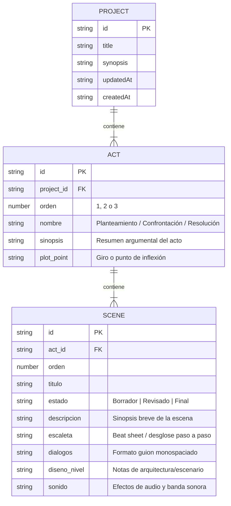

# 📖 Documentación de Desarrollo - GuionStudio

**GuionStudio** es una aplicación *Local-First* diseñada para escritores y diseñadores narrativos de videojuegos. Permite estructurar la narrativa en **Actos (Estructura de 3 Actos)** y **Escenas**, desglosando la escaleta detallada, los diálogos en formato técnico, las notas de diseño de nivel y los efectos de sonido.

---

## 🏗️ 1. Arquitectura Técnica y Tecnologías

| Capa | Tecnología | Descripción |
| :--- | :--- | :--- |
| **Framework de Escritorio** | **Tauri v2** | Proporciona un entorno liviano, rápido y seguro sobre Rust (`src-tauri`). |
| **Frontend** | **React 19 + TypeScript + Vite** | Interfaz reactiva en tiempo real con verificación estática de tipos. |
| **Estilos CSS** | **TailwindCSS 3.4** | Sistema de diseño adaptable (modo oscuro/claro) con estética *slate dark* y *glassmorphism*. |
| **Persistencia Backend** | **SQLite (`tauri-plugin-sql` / `rusqlite`)** | Migraciones de base de datos relacional para proyectos, actos y escenas en entorno de escritorio. |
| **Persistencia Frontend** | **`localStorage` + JSON / MD** | Capa de almacenamiento local automático y selector nativo de archivos con respaldo ante entornos sin IPC. |
| **Testing** | **Vitest + React Testing Library + Rust Cargo** | Cobertura de pruebas unitarias de UI (11 tests passing) y pruebas de base de datos Rust. |

---

## 📐 2. Modelo de Datos Narrativo



---

## 🌟 3. Módulos y Funcionalidades Principales

### 3.1. Tablero Narrativo Unificado por Actos
- **Disposición Fluida**: Rejilla responsiva (`grid grid-cols-1 md:grid-cols-3`) que se adapta automáticamente a cualquier resolución de pantalla.
- **Actos Predefinidos**:
  - **Acto 1: Planteamiento** (Plot Point 1)
  - **Acto 2: Confrontación** (Plot Point 2)
  - **Acto 3: Resolución** (Clímax)
- **Visualización de Badges**: Cada acto cuenta con etiquetas identificativas con el nombre del acto (`Acto 1: Planteamiento`), contador de escenas y resumen de Plot Point.

### 3.2. Tarjetas de Escena (Vista Compacta e Inline)
- **Modo Compacto por Defecto**: Muestra número de orden, título, selector de acto con reasignación en 1 clic, badge de estado interactivo (`Borrador` / `Revisado` / `Final`) y botones de reordenamiento inmediato (`▲` / `▼`).
- **Nuevas Escenas**: Al crear una escena, inicia contraída para mantener el tablero ordenado.
- **Despliegue Inline**: Al hacer clic en una tarjeta, se expanden sus detalles dentro de la misma columna.

### 3.3. Edición en Ventana Maximizada (`⛶`)
- Botón **`⛶ Maximizar`** en cada escena para abrir una ventana a pantalla completa dedicada a la redacción fluida.
- **Campos Separados**:
  - **Descripción / Sinopsis**: Resumen argumental.
  - **Escaleta (Escena Detallada)**: Desglose secuencial paso a paso de la escena (*Beat Sheet*).
  - **Diálogos**: Editor monospaciado estilo guion de cine y videojuegos.
  - **Notas Técnicas**: Diseño de Nivel y Efectos de Sonido.
- **Control de Cambios con `✓ Aceptar` y `Cancelar`**: Las ediciones en la ventana maximizada se trabajan en un borrador temporal (*draft*). `Cancelar` descarta los cambios sin afectar el estado original, y `✓ Aceptar` los consolida.

### 3.4. Gestión de Proyectos ("📂 Archivo")
Ubicado en el menú desplegable de la barra superior:
- **📄 Nuevo Proyecto**: Reinicia el estado a un nuevo guion con confirmación.
- **📂 Abrir Proyecto...**: Importa archivos de proyecto JSON (`.json`, `.guion`).
- **💾 Guardar (.json)**: Almacena en `localStorage` / SQLite y genera copia de respaldo.
- **📑 Guardar Como...**: Abre la modal interactiva con el selector nativo del sistema de archivos (`showSaveFilePicker`) para elegir la ruta de destino.
- **📝 Guardar en .md**: Exporta directamente el guion a formato Markdown (.md).
- **📖 Lector Markdown (.md)**: Abre el visor modal interactivo.

### 3.5. Lector de Guion en Markdown Integrado
- Compila todo el proyecto en un documento Markdown formateado.
- **Copiar**: Copia el texto al portapapeles con 1 clic.
- **Descargar .md**: Descarga el guion técnico en archivo plano Markdown.

---

## 🧪 4. Guía de Ejecución y Pruebas

### 4.1. Ejecutar las Pruebas Unitarias del Frontend (Vitest)
```bash
npm run test
```
*Resultado*: **11 tests unitarios aprobados exitosamente** en [src/App.test.tsx](file:///C:/Users/lisan/OneDrive/Escritorio/guionstudio/guion-studio/src/App.test.tsx).

### 4.2. Ejecutar las Pruebas Backend de Rust
```bash
cargo test --manifest-path src-tauri/Cargo.toml
```
*Resultado*: Pruebas de integración y migraciones de SQLite pasadas en `src-tauri/src/main.rs`.

### 4.3. Compilar la Aplicación para Producción
```bash
npm run build
```

---

## 📁 5. Estructura de Archivos Clave

```
guion-studio/
├── AGENTS.md               # Guía técnica y directivas para Agentes IA
├── DOCUMENTACION_DESARROLLO.md # Documentación detallada de arquitectura y modelos
├── README.md               # Resumen público del proyecto y guía rápida
├── src/
│   ├── App.tsx             # Aplicación principal React (Tablero, Modales, Estado, Lector MD)
│   ├── App.test.tsx        # Suite de 11 pruebas unitarias Vitest
│   ├── main.tsx            # Punto de entrada de React
│   └── index.css           # Directivas TailwindCSS y utilidades de diseño
├── src-tauri/
│   ├── Cargo.toml          # Configuración de dependencias de Rust
│   ├── tauri.conf.json     # Configuración del paquete Tauri v2
│   └── src/
│       ├── main.rs         # Servidor Rust, migraciones SQLite y comandos IPC
│       └── models.rs       # Estructuras de datos Rust para IPC
└── package.json            # Scripts de ejecución, build y vitest
```
